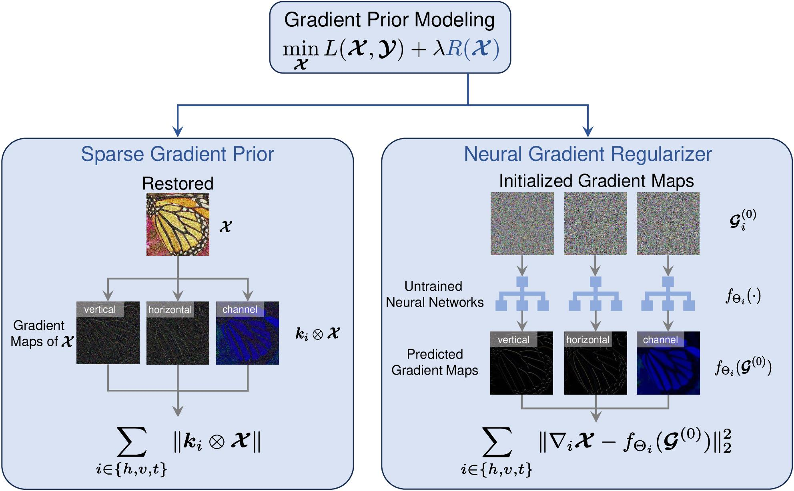
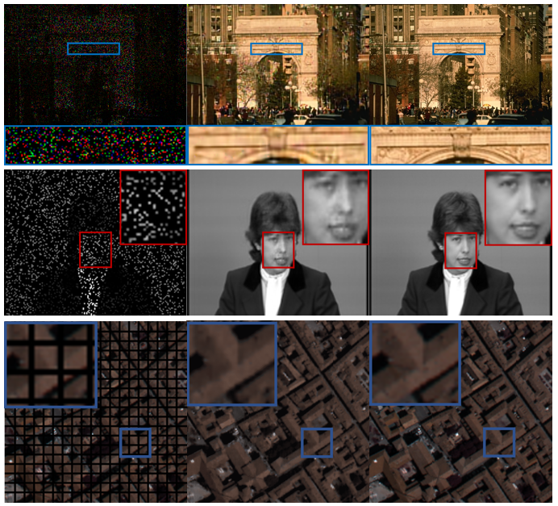
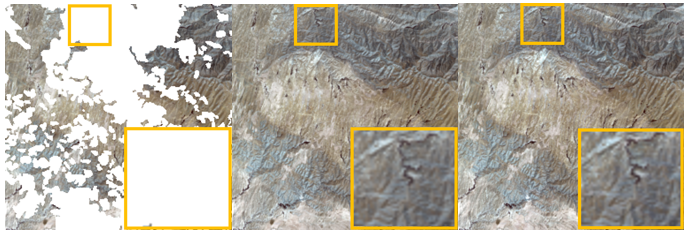
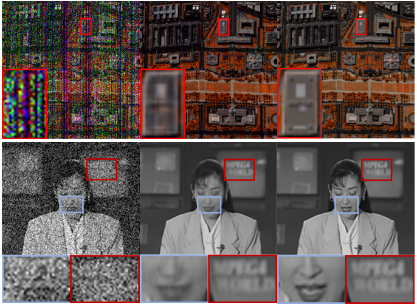

# Neural-Gradient-Regularizer
This repository contains official implementation of **N**eural **G**radient **R**egularizer (NGR). [[paper]](https://arxiv.org/abs/2308.16612)

<p align="center"></p>

Owing to its significant success, the prior imposed on gradient maps has consistently been a subject of great interest in the field of image processing. Total variation (TV), one of the most representative regularizers, is known for its ability to capture the sparsity of gradient maps. Nonetheless, TV and its variants often underestimate the gradient maps, leading to the weakening of edges and details whose gradients should not be zero in the original image. Recently, total deep variation (TDV) has been introduced, assuming the sparsity of feature maps, which provides a flexible regularization learned from large-scale datasets for a specific task. However, TDV requires retraining when the image or task changes, limiting its versatility. In this paper, we propose a neural gradient regularizer (NGR) that expresses the gradient map as the output of a neural network. Unlike existing methods, NGR does not rely on the sparsity assumption, thereby avoiding the underestimation of gradient maps. NGR is applicable to various image types and different image processing tasks, functioning in a zero-shot learning fashion, making it a versatile and plug-and-play regularizer. Extensive experimental results demonstrate the superior performance of NGR over state-of-the-art counterparts for a range of different tasks, further validating its effectiveness and versatility.

## Getting Started

Only Pytorch 2.0.0 and some basic packages are required, please install them by pip or conda.

Please download our example datas from [this](https://drive.google.com/drive/folders/1EeLXCtTOChVzVz-zQ_VJYbXSPjB4RlG1?usp=drive_link). 

Running by following script:

```python
$ python RGB_inpainting.py
$ python MC_inpainting.py
$ python decloud.py
$ python video_denoising.py
$ python HSI_denoising.py
```

## Reference results

### Inpainting

<p align="center"></p>

|      | 148089 | claire | PA    |
| :--: | :----: | ------ | ----- |
| PSNR | 23.96  | 41.05  | 33.78 |
| SSIM | 0.761  | 0.990  | 0.962 |

### Decloud

<p align="center"></p>

|      | Forish Mountain |
| :--: | :-------------: |
| PSNR |      35.98      |
| SSIM |      0.933      |

### Denoising

<p align="center"></p>

|      | WDC   | akiyo |
| ---- | ----- | ----- |
| PSNR | 27.66 | 35.86 |
| SSIM | 0.837 | 0.967 |
